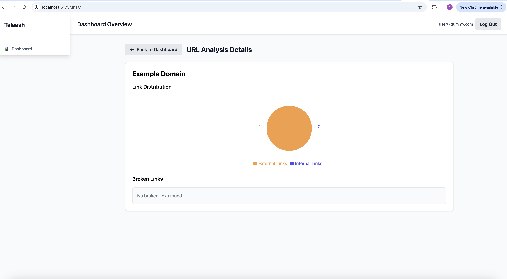
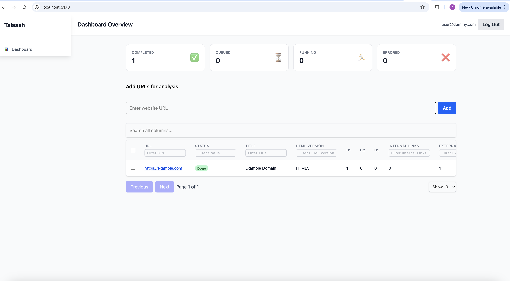

# Talaash - URL Analysis Tool

A full-stack web application for analyzing URLs and extracting metadata, built with React/TypeScript frontend and Go backend.

## Screenshots


*Dashboard showing URL analysis table with bulk actions and real-time status updates*


*Detailed view of a single URL analysis with comprehensive metadata and statistics*

## ⚠️ Current Status & Challenges

### Incomplete Features
- **Real-time Updates**: Frontend has Server-Sent Events implementation, but backend needs to implement SSE endpoints
- **Cancellation Mechanism**: Backend has cancellation logic, but frontend needs to implement cancel/stop functionality
- **Bulk Actions Mechanism**: Needs to be implemented


### Current Limitations
1. **Client-side Rendered Apps**: Netflix and similar SPAs return insufficient data through Colly. Need headless browser (chromedp) for full JavaScript rendering.
2. **Iframe Content**: Iframes are not crawled. Need to extract iframe `src` and crawl separately.
3. **Concurrent Link Checking**: Checking inaccessible links is a blocking operation. Should be offloaded to separate processes/goroutines for partial responses.
4. **Bot Detection**: Some sites return 403 Forbidden due to bot detection.
5. **Dynamic Login Forms**: Login forms added via JavaScript may be missed by Colly. Chromedp would handle this better.

### Performance Considerations
- **Colly vs Chromedp**: Colly is faster but limited for SPAs. Chromedp provides full rendering but requires more infrastructure.
- **Concurrent Processing**: Link checking should be asynchronous to avoid blocking the main crawl.
- **Infrastructure**: Chromedp requires Chromium installation and more resources.

## Features

- **URL Analysis**: Crawl websites and extract metadata (title, headings, links, forms, etc.)
- **Real-time Updates**: Server-Sent Events for live status updates (backend implementation needed)
- **Bulk Operations**: Select multiple URLs for batch processing
- **Authentication**: Secure Auth0 integration
- **Responsive Design**: Mobile-first approach with table/card views
- **Error Handling**: Robust error handling and user feedback

## Architecture

### Frontend
- **React + TypeScript + Vite** for fast, modern SPA development
- **Auth0** for authentication and route protection
- **Tailwind CSS** for styling
- **React Router** for navigation
- **Server-Sent Events** for real-time updates (ready for backend implementation)

### Backend
- **Go** with **Gin** framework
- **GORM** for database operations
- **Colly** for web scraping
- **MySQL** database
- **Docker** for containerization
- **Context cancellation** for stopping crawls (frontend integration needed)

## Quick Start

### Prerequisites
- Node.js 22+
- Go 1.24+
- Docker and Docker Compose
- MySQL (or use Docker)
- Auth0 account (free tier available) - enables Google login and other social providers
- **Important**: Copy all secrets from `.env.example` files to `.env` files in both frontend and backend folders before starting the project

### 1. Clone and Setup

```bash
git clone <repository-url>
cd web-scraper
```

### 2. Environment Setup

Create environment files for both frontend and backend:

```bash
# Frontend environment
cd frontend
cat > .env << EOF
VITE_AUTH0_DOMAIN=your-auth0-domain
VITE_AUTH0_CLIENT_ID=your-auth0-client-id
VITE_AUTH0_AUDIENCE=your-auth0-api-identifier
VITE_API_URL=http://localhost:8080
EOF

# Backend environment
cd ../backend
cat > .env << EOF
DB_HOST=localhost
DB_PORT=3306
DB_USER=go_user
DB_PASSWORD=go_user_password
DB_NAME=url_analyzer_db
EOF

cd ..
```

**Important**: Update the `.env` files with your actual Auth0 credentials and database settings. Auth0 enables login with Google, GitHub, and other social providers out of the box.
**Important**: Make sure MySQL server is running on your machine before starting the backend.

### 3. Backend Setup

#### Option A: Using Docker (Recommended)

```bash
# First Start MySQL with Docker
docker run --name url-analyzer-mysql \
  -e MYSQL_ROOT_PASSWORD=my_secure_root_password \
  -e MYSQL_DATABASE=url_analyzer_db \
  -e MYSQL_USER=go_user \
  -e MYSQL_PASSWORD=go_user_password \
  -p 3306:3306 \
  -d mysql/mysql-server:8.0

  #### Then Start Backend
```bash
cd backend
go mod download
go run main.go
```

# Or use Docker Compose (if available)
cd backend
docker-compose up -d
```

The backend will run at `http://localhost:8080`

### 4. Frontend Setup

```bash
cd frontend
npm install
```

Start the development server:
```bash
npm run dev
```

The frontend will run at `http://localhost:5173`

## Testing

### Frontend Tests

#### Unit Tests (Jest)
```bash
cd frontend
npm test                    # Run all tests
npm test -- --watch        # Watch mode
npm test -- src/__tests__  # Run specific directory
```

#### E2E Tests (Playwright)
```bash
# Start mock backend
cd backend/test
npm install express cors
node mock-server.js

# In another terminal, run frontend with mock auth
cd frontend
VITE_USE_MOCK_AUTH=true VITE_API_URL=http://localhost:3001 npm run dev

# Run E2E tests
npm run test:e2e -- test/dashboard.spec.ts
```

### Backend Tests
```bash
cd backend
go test ./...
go test -v ./services/...  # Verbose output
```

### Test Server for Link Checking
For testing inaccessible links functionality:
```bash
cd backend/test
go run server.go
```
This starts a test server on port 8000 that provides HTTP links for testing inaccessible links detection. Useful for testing the link checking functionality in the crawler.


Project Structure

```
web-scraper/
├── backend/
│   ├── config/           # Environment configuration
│   ├── middlewares/      # HTTP middlewares (auth, CORS)
│   ├── models/           # Database models
│   ├── services/         # Business logic (crawler, workers)
│   ├── test/             # Mock server for testing
│   └── main.go           # Application entry point
├── frontend/
│   ├── src/
│   │   ├── components/   # React components
│   │   ├── auth/         # Authentication logic
│   │   ├── api/          # API layer
│   │   ├── hooks/        # Custom React hooks
│   │   └── utils/        # Utility functions
│   ├── test/             # E2E tests
│   └── public/           # Static assets
└── README.md
```

## Development Notes

### Frontend
- Uses Auth0 for authentication (free tier available)
- Real-time updates via Server-Sent Events (ready for backend implementation)
- Mobile-first responsive design
- Code splitting for performance
- Comprehensive error handling

### Backend
- Worker pool for concurrent URL processing
- Context cancellation for stopping crawls (frontend integration needed)
- Robust error handling and logging
- Database migrations and seeding
- Mock server for testing
